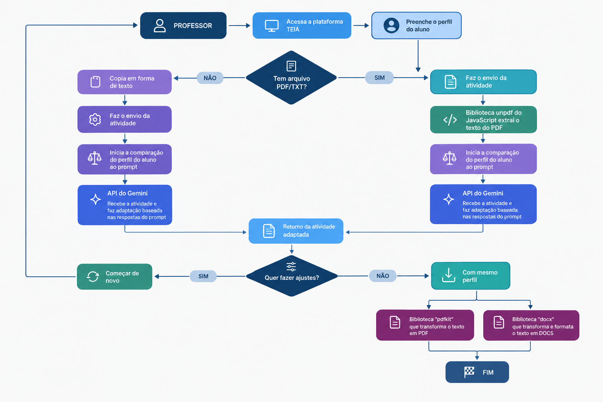

<div align="center">

  <h1>🧩 TEIA - Tecnologia Educacional Inclusiva e Adaptativa</h1>

  <p>
    <strong>
      Plataforma educacional que utiliza Inteligência Artificial para adaptar
      conteúdos e tornar experiências de aprendizagem mais acessíveis e personalizadas.
    </strong>
  </p>

  <br/>

  

  <br/>
  <br/>

  <a href="https://github.com/steffanymachadotk-ai/TEIA-MVP">
    
  </a>
  
  
  
  

</div>

---

# 💡 Sobre o Projeto

O **TEIA (Tecnologia Educacional Inclusiva e Adaptativa)** é uma solução de tecnologia educacional desenvolvida para explorar o uso de **Inteligência Artificial na adaptação de conteúdos de aprendizagem**.

A plataforma permite que o usuário forneça um conteúdo educacional e um perfil de aprendizagem. A partir dessas informações, o sistema utiliza a **API do Google Gemini** para analisar o material e gerar uma versão adaptada.

O projeto combina **desenvolvimento web, processamento de documentos e Inteligência Artificial generativa** em uma única aplicação.

> **Problema:** conteúdos educacionais geralmente são disponibilizados em um formato único, mesmo quando estudantes possuem diferentes necessidades e formas de aprendizagem.

> **Proposta:** utilizar tecnologia e Inteligência Artificial para adaptar esses conteúdos de acordo com o perfil do estudante.

---

# 🎯 Objetivos

O principal objetivo do TEIA é explorar como a Inteligência Artificial pode ser utilizada para **reduzir barreiras no acesso e na compreensão de conteúdos educacionais**.

A plataforma busca:

* ♿ Tornar conteúdos potencialmente mais acessíveis;
* 🧠 Adaptar materiais de acordo com o perfil do aluno;
* 🤖 Utilizar Inteligência Artificial em um problema educacional real;
* 📄 Trabalhar com conteúdos provenientes de documentos;
* 💻 Centralizar o processo de adaptação em uma aplicação web;
* 📚 Permitir ajustes e uma nova adaptação quando necessário.

---

# 🚀 Funcionalidades

* 👤 Definição do perfil do aluno;
* 📝 Inserção de atividades e conteúdos educacionais;
* 📄 Envio de arquivos para processamento;
* 🔎 Extração de texto de documentos;
* 🤖 Integração com a API do Google Gemini;
* 🧠 Análise do perfil do aluno em conjunto com o conteúdo da atividade;
* ✨ Geração de conteúdo adaptado;
* 🔄 Possibilidade de solicitar novos ajustes;
* 📥 Exportação do conteúdo adaptado;
* 📑 Geração de arquivos em PDF e DOCX.

---

# 🧠 Fluxo da Aplicação

O funcionamento do TEIA pode ser representado pelo seguinte fluxo:

<div align="center">



</div>

### Fluxo simplificado

```text
Perfil do aluno
       ↓
Atividade / conteúdo
       ↓
Verificação do arquivo
       ↓
Extração do conteúdo
       ↓
Análise do perfil e da atividade
       ↓
Google Gemini
       ↓
Conteúdo adaptado
       ↓
Ajustes
       ↓
Exportação em PDF ou DOCX
```

---

# 🤖 Inteligência Artificial

O TEIA utiliza a **API do Google Gemini** como parte central do processo de adaptação.

O modelo recebe informações relacionadas ao:

* perfil do aluno;
* conteúdo da atividade;
* contexto necessário para a adaptação.

A aplicação então utiliza a resposta gerada pelo modelo para produzir o conteúdo adaptado.

A IA, portanto, não está presente apenas como um chatbot: ela participa diretamente do **processo de transformação do conteúdo educacional**.

---

# 🛠️ Tecnologias Utilizadas

| Tecnologia               | Finalidade                                  |
| ------------------------ | ------------------------------------------- |
| 🟨 **JavaScript**        | Desenvolvimento da aplicação                |
| 🟢 **Node.js**           | Ambiente de execução do back-end            |
| ⚡ **Express**            | Servidor e definição das rotas da aplicação |
| 🤖 **Google Gemini API** | Processamento e adaptação dos conteúdos     |
| 📄 **unpdf**             | Extração de conteúdo de arquivos PDF        |
| 📑 **docx**              | Processamento e geração de documentos DOCX  |
| 📄 **PDFKit**            | Geração de arquivos PDF                     |
| 📤 **Multer**            | Upload e processamento de arquivos          |
| 🔗 **CORS**              | Comunicação entre diferentes origens        |
| 🔐 **dotenv**            | Gerenciamento de variáveis de ambiente      |
| 🐙 **Git / GitHub**      | Versionamento e colaboração                 |

---

# 📸 Demonstração

## Interface

<div align="center">


</div>

## Chat com Inteligência Artificial

<div align="center">


</div>

## Fluxo da solução

<div align="center">


</div>

---

# 👩‍💻 Minha Contribuição

Atuei na **evolução, recuperação e organização técnica do TEIA**, trabalhando diretamente em diferentes partes da aplicação.

Entre as atividades realizadas estão:

* Integração da aplicação com a **API do Google Gemini**;
* Recuperação da integração com o serviço de Inteligência Artificial;
* Configuração e gerenciamento de variáveis de ambiente;
* Processamento de arquivos e conteúdos educacionais;
* Manutenção do back-end em Node.js;
* Identificação e correção de problemas durante a execução;
* Tratamento de erros relacionados à integração com serviços externos;
* Organização do projeto para versionamento;
* Aplicação de boas práticas para proteção de credenciais;
* Publicação e organização do projeto no GitHub;
* Documentação técnica da aplicação.

---

# 📈 Competências Demonstradas

O desenvolvimento do TEIA proporcionou experiência prática em:

### Inteligência Artificial

* Integração com APIs de IA;
* Aplicação de IA generativa;
* Engenharia de prompts;
* Processamento e adaptação de conteúdo.

### Desenvolvimento

* JavaScript;
* Node.js;
* Express;
* APIs;
* Upload e processamento de arquivos.

### Engenharia de Software

* Git e GitHub;
* Gerenciamento de dependências;
* Variáveis de ambiente;
* Debugging;
* Tratamento de erros;
* Manutenção e evolução de código existente.

### Tecnologia aplicada

* Desenvolvimento de MVP;
* Resolução de problemas reais;
* Aplicação de IA em educação;
* Acessibilidade e inclusão digital.

---

# 📁 Estrutura do Projeto

```text
TEIA-MVP/
│
├── assets/
│   └── images/
│       ├── CHAT.png
│       ├── Estrutura.png
│       ├── banner.png
│       ├── cmd.png
│       ├── ensino.png
│       ├── logo.png
│       └── sobre o projeto.png
│
├── index.html
├── script.js
├── style.css
├── server.js
├── package.json
├── package-lock.json
├── .gitignore
└── README.md
```

---

# ⚙️ Como Executar Localmente

## Pré-requisitos

Antes de executar o projeto, você precisará ter instalado:

* **Node.js**
* **npm**
* Navegador atualizado;
* Uma chave válida da **Google Gemini API**.

---

## 1. Clone o repositório

```bash
git clone https://github.com/steffanymachadotk-ai/TEIA-MVP.git
```

Entre na pasta:

```bash
cd TEIA-MVP
```

---

## 2. Instale as dependências

```bash
npm install
```

---

## 3. Configure a variável de ambiente

Crie um arquivo chamado `.env` na raiz do projeto:

```env
GEMINI_API_KEY=sua_chave_aqui
```

> ⚠️ **Nunca publique sua chave da API no GitHub.**

O arquivo `.env` está incluído no `.gitignore` do projeto.

---

## 4. Execute a aplicação

```bash
npm start
```

O servidor será iniciado em:

```text
http://localhost:6767
```

Abra o endereço no navegador.

---

# 🔐 Segurança

As credenciais utilizadas pela aplicação são armazenadas através de **variáveis de ambiente**.

O arquivo `.env` não faz parte do código-fonte público do projeto e está configurado no `.gitignore`.

Essa abordagem evita que chaves de API sejam expostas diretamente no repositório.

---

# 🔮 Próximos Passos

O TEIA continua em evolução. Entre os próximos aprimoramentos estão:

* [ ] Melhorar a personalização das adaptações;
* [ ] Ampliar os formatos de documentos suportados;
* [ ] Melhorar a experiência da interface;
* [ ] Adicionar histórico de conteúdos adaptados;
* [ ] Implementar autenticação de usuários;
* [ ] Criar testes automatizados;
* [ ] Aprimorar os recursos de acessibilidade;
* [ ] Disponibilizar uma versão online.

---

# 📌 Status do Projeto

<div align="center">

### 🟢 MVP FUNCIONAL

O TEIA está em desenvolvimento contínuo e faz parte do meu portfólio de projetos em **Inteligência Artificial, desenvolvimento de software e tecnologia aplicada à educação**.

</div>

---

# 👩‍💻 Autora

<div align="center">

### Steffany Machado

Estudante de **Inteligência Artificial**, com interesse em Inteligência Artificial, dados e desenvolvimento de soluções tecnológicas para problemas reais.

<br/>

<a href="https://github.com/steffanymachadotk-ai">
  
</a>

</div>

---

<div align="center">

**🧩 TEIA — Tecnologia + Inclusão + Inteligência Artificial**

<br/>

⭐ Se este projeto despertou seu interesse, considere visitar o repositório e conhecer a implementação.

<br/>

<a href="#-teia--tecnologia-educacional-inclusiva-e-adaptativa">
  Voltar ao topo ↑
</a>

</div>


