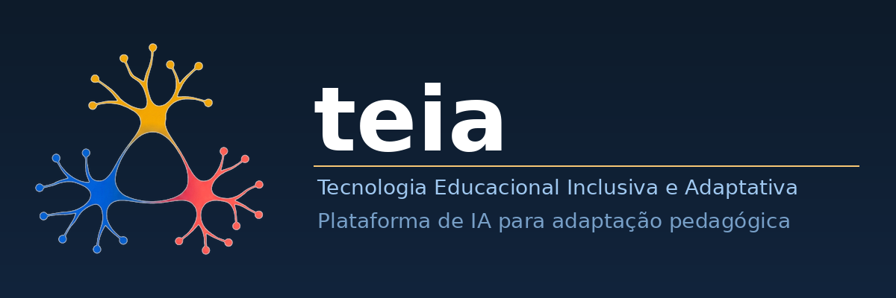
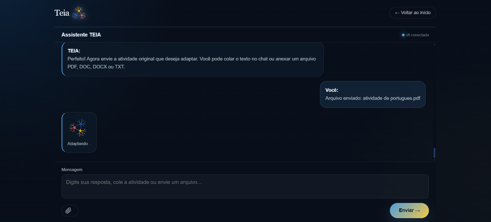
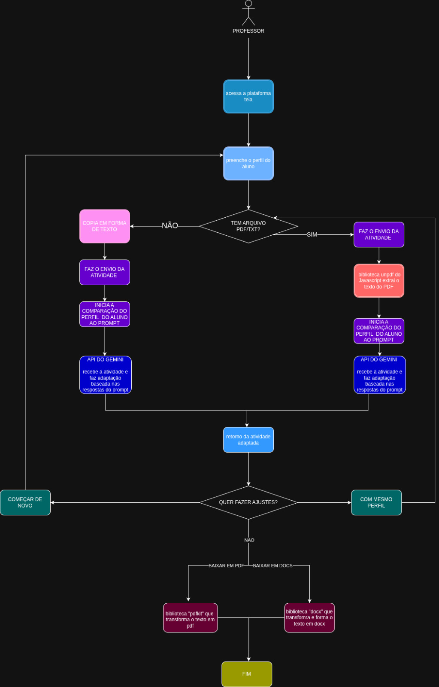

````markdown
# 🧩 TEIA — Tecnologia Educacional Inclusiva e Adaptativa

> Plataforma educacional que utiliza Inteligência Artificial para transformar e adaptar conteúdos digitais, buscando tornar a aprendizagem mais acessível e personalizada.

[](https://developer.mozilla.org/en-US/docs/Web/JavaScript)
[](https://nodejs.org/)
[](https://expressjs.com/)
[](https://ai.google.dev/)
[](https://github.com/steffanymachadotk-ai/TEIA-MVP)


## 💡 Sobre o projeto

O **TEIA (Tecnologia Educacional Inclusiva e Adaptativa)** é um projeto de tecnologia educacional desenvolvido com foco no uso de **Inteligência Artificial para adaptação de conteúdos de aprendizagem**.

A plataforma permite trabalhar com materiais educacionais e utilizar IA para analisar e transformar esses conteúdos, criando uma experiência potencialmente mais adequada a diferentes necessidades de aprendizagem.

O projeto surgiu a partir de uma pergunta:

> **Como utilizar Inteligência Artificial para reduzir barreiras no acesso e na compreensão de conteúdos educacionais?**

A partir dessa ideia, o TEIA combina uma aplicação web, processamento de documentos e integração com modelos de Inteligência Artificial.


## 🚀 Principais funcionalidades

- 🤖 Integração com Inteligência Artificial através da API do Google Gemini
- 📄 Processamento de documentos educacionais
- 💬 Interface de interação com IA
- 🧠 Adaptação e transformação de conteúdos
- ♿ Foco em acessibilidade e inclusão educacional
- 📚 Utilização de materiais existentes como entrada para o processo de adaptação
- 🌐 Interface web para interação com a solução


## 🧠 Como funciona

O fluxo principal da aplicação pode ser representado da seguinte forma:

```text
                 ┌──────────────────┐
                 │      Usuário     │
                 └────────┬─────────┘
                          │
                          ▼
                 ┌──────────────────┐
                 │  Interface Web   │
                 └────────┬─────────┘
                          │
                          ▼
                 ┌──────────────────┐
                 │ Node.js +        │
                 │ Express          │
                 └────────┬─────────┘
                          │
              ┌───────────┴───────────┐
              │                       │
              ▼                       ▼
      ┌───────────────┐       ┌────────────────┐
      │ Processamento │       │ Google Gemini  │
      │ de documentos │──────►│      API       │
      └───────────────┘       └───────┬────────┘
                                      │
                                      ▼
                             ┌──────────────────┐
                             │ Conteúdo         │
                             │ adaptado        │
                             └──────────────────┘
````


## 🎯 O problema

Conteúdos educacionais normalmente são disponibilizados em um formato único, mesmo quando os estudantes possuem diferentes formas de compreender, processar e interagir com as informações.

O TEIA explora a aplicação de Inteligência Artificial como uma camada de **adaptação e personalização do conteúdo**, buscando tornar materiais educacionais mais acessíveis.


## 🔎 Diferencial

O TEIA não utiliza Inteligência Artificial apenas como um chatbot.

A IA faz parte de um fluxo de transformação de conteúdo:

```text
Material educacional
        ↓
Análise do conteúdo
        ↓
Processamento com IA
        ↓
Adaptação
        ↓
Conteúdo transformado
```

Essa abordagem permite explorar a IA aplicada a um problema concreto de **acessibilidade, inclusão e personalização da aprendizagem**.


## 🛠️ Tecnologias utilizadas

### Front-end

* HTML5
* CSS3
* JavaScript

### Back-end

* Node.js
* Express

### Inteligência Artificial

* Google Gemini API

### Processamento de documentos

* PDF
* DOCX
* `unpdf`
* `pdfkit`
* `docx`

### Outras tecnologias

* Multer
* CORS
* dotenv
* npm
* Git
* GitHub


## 📸 Demonstração

### Interface principal



### Chat com Inteligência Artificial



### Estrutura da aplicação




## ⚙️ Como executar localmente

### Pré-requisitos

* Node.js
* npm
* Uma chave da API do Google Gemini

### 1. Clone o repositório

```bash
git clone https://github.com/steffanymachadotk-ai/TEIA-MVP.git
```

### 2. Acesse a pasta

```bash
cd TEIA-MVP
```

### 3. Instale as dependências

```bash
npm install
```

### 4. Configure a variável de ambiente

Crie um arquivo `.env` na raiz do projeto:

```env
GEMINI_API_KEY=sua_chave_aqui
```

> **Importante:** nunca publique sua chave da API no GitHub.

### 5. Inicie o servidor

```bash
npm start
```

O servidor será iniciado em:

```text
http://localhost:6767
```


## 📁 Estrutura do projeto

```text
TEIA-MVP/
│
├── assets/
│   └── images/
│       ├── CHAT.png
│       ├── Estruturaa.png
│       ├── banner.png
│       ├── cmd.png
│       ├── ensino.png
│       ├── logo.png
│       └── sobre o projeto.png
│
├── index.html
├── script.js
├── style.css
├── server.js
├── package.json
├── package-lock.json
├── .gitignore
└── README.md
```


## 👩‍💻 Minha contribuição

Atuei na evolução e recuperação do projeto, trabalhando diretamente com a aplicação web, integração com Inteligência Artificial e processamento de documentos.

Entre as atividades realizadas estão:

* Desenvolvimento e manutenção da aplicação;
* Integração com a API do Google Gemini;
* Implementação e recuperação da comunicação entre aplicação e modelo de IA;
* Processamento de arquivos e conteúdos educacionais;
* Configuração do ambiente Node.js;
* Identificação e correção de problemas de integração;
* Configuração de variáveis de ambiente;
* Organização do projeto para versionamento;
* Aplicação de boas práticas para proteção de informações sensíveis;
* Versionamento e publicação do projeto no GitHub;
* Documentação técnica do projeto.


## 🧠 Competências demonstradas

Este projeto reúne competências relacionadas às áreas de **Inteligência Artificial, desenvolvimento web e tecnologia aplicada a problemas reais**.

### Desenvolvimento

* JavaScript
* Node.js
* Express
* HTML
* CSS
* APIs

### Inteligência Artificial

* Integração com APIs de IA
* Engenharia de prompts
* Aplicação de IA em fluxos de processamento
* Adaptação e transformação de conteúdo

### Engenharia de software

* Git e GitHub
* Gerenciamento de dependências com npm
* Variáveis de ambiente
* Debugging
* Resolução de problemas
* Organização de projetos

### Processamento de dados e documentos

* Processamento de PDF
* Processamento de DOCX
* Upload de arquivos
* Transformação de conteúdo


## 📈 Aprendizados

O desenvolvimento do TEIA proporcionou experiência prática em situações comuns do desenvolvimento de software, como:

* integração com serviços externos;
* gerenciamento de credenciais e variáveis de ambiente;
* diagnóstico de erros de API;
* tratamento de indisponibilidade temporária de serviços;
* processamento de diferentes formatos de arquivos;
* organização de código para manutenção;
* versionamento seguro com Git;
* recuperação e evolução de um projeto existente.


## 🔮 Próximos passos

* [ ] Melhorar a personalização das adaptações
* [ ] Ampliar os formatos de documentos suportados
* [ ] Adicionar histórico de conteúdos processados
* [ ] Implementar autenticação de usuários
* [ ] Melhorar testes automatizados
* [ ] Aprimorar a experiência da interface
* [ ] Disponibilizar uma versão online
* [ ] Expandir os recursos de acessibilidade


## 📌 Status

**MVP funcional — em evolução.**

O TEIA continua sendo aprimorado como projeto de portfólio e como experimento prático na aplicação de Inteligência Artificial a problemas de acessibilidade e educação.


## 👩‍💻 Desenvolvido por

### Steffany Machado

Estudante de **Inteligência Artificial**, interessada em desenvolvimento de soluções tecnológicas, Inteligência Artificial, dados e aplicação prática de tecnologia para resolver problemas reais.

(https://img.shields.io/badge/GitHub-Steffany%20Machado-black?logo=github)](https://github.com/steffanymachadotk-ai)


## 📂 Repositório

[**Acessar o código-fonte do TEIA no GitHub →**](https://github.com/steffanymachadotk-ai/TEIA-MVP)

```

**Esse é o que eu colocaria agora no repositório.** Ele vende o TEIA como projeto técnico de verdade, mas sem inventar funcionalidades que o código não tenha.
```
